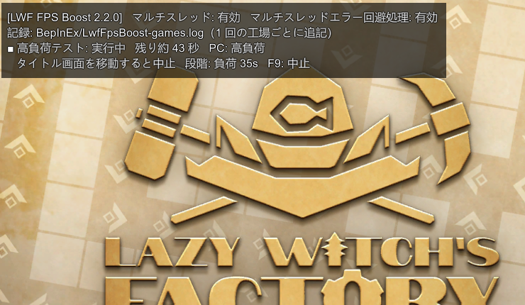
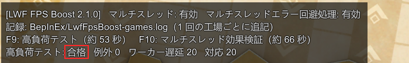

# LWF FPS Boost

**Lazy Witch's Factory** の FPS改善 MOD（ver0.27.0 で動作確認）

> ⚠ **人柱版**。不具合が出る恐れあり。エラーのデータ収集も兼ねる

- 使い魔が多い工場で重くなるのを軽くする（フレーム時間が約半分）
- 描画（Spine）のアニメ更新とメッシュ生成をマルチスレッドで処理する

**[最新版をダウンロード](https://github.com/KiyonakaNata/lwf-fps-boost/releases/latest)**

## 導入

1. [BepInEx 5.x (win x64)](https://github.com/BepInEx/BepInEx/releases) をゲームフォルダに展開
2. ゲームを一度起動して終了
3. `LwfFpsBoost.dll` を `BepInEx/plugins/` に置く
4. ゲームを起動する。タイトル画面の左上に案内が出れば動いている

MOD管理ソフトを使うなら [Thunderstore](https://thunderstore.io/c/lazy-witchs-factory/p/KiyonakaNata/LwfFpsBoost/) から

## 使い方

- 入れるだけで有効。表示が出るのはタイトル画面だけで、事務所や工場では何も出ない
- 初回はタイトル画面で **F9**（高負荷テスト）を回し、**合格**が出ることを確かめる

| キー（タイトル画面） | 動作 |
|---|---|
| F9 | 高負荷テスト（約 53 秒）→ 合格／不合格／判定不能 |
| F10 | マルチスレッド効果検証（約 66 秒）→ 1 フレームあたりの短縮 ms と倍率 |

*高負荷テスト中*

*合格*

### 備考
- テスト中は PC が重くなる
- テスト中にタイトル画面から移動すると、テストは中止されマルチスレッドが無効になる → ゲームを再起動
- 判定不能 → もう一度 F9
- 不合格 → `BepInEx/LwfFpsBoost-incidents.log` を添えて報告
- テストでエラーが出たあとは、次にゲームを起動したとき 1 回だけゲームのエラー画面が出る（前回分の再表示）→ 閉じてゲームを再起動

## Mod の効果

作成者の環境での一例（Ryzen 7 5700X 8C/16T・使い魔 1500 体）

| Mod | フレーム時間 | fps |
|---|---|---|
| あり | 21.9 ms | 45.6 |
| なし | 51.1 ms | 19.6 |

- 効果は CPU の論理スレッド数で変わる。少ないほど小さく、1 スレッドでは変化なし

## 報告のお願い

- 報告先は [公式 Discord](https://discord.com/invite/pZjA34FCWQ) の Mod チャンネル
- `BepInEx/` に自動で書かれる 2 つのファイルを添える
- 問題が無かったときも `LwfFpsBoost-games.log` は添える

| ファイル | 中身 |
|---|---|
| `LwfFpsBoost-games.log` | 工場 1 回ごとの記録。PC 構成・プレイ時間・終了理由・フレーム時間の平均と最悪・回避処理が働いた回数。タイトル画面のテスト結果も入る |
| `LwfFpsBoost-incidents.log` | Spine 由来のエラーが出たときだけ生成。タイトル画面に「エラー記録: N 件」と出る |

どちらもゲーム作者にそのまま渡せる書式。

## 設定

`BepInEx/config/kiyonakanata.lwffpsboost.cfg`

| 設定 | 既定 | 意味 |
|---|---|---|
| `1. General/Enabled` | true | false で Mod 無効 |

キー（F9 / F10）と文字サイズは固定。`9. Developer` 節は開発用。触らない

## 注意

- 非公式の Mod。ゲーム本体の更新で動かなくなることがある。動かなくなったら外す
- 本体がマルチスレッド化を入れたら、この Mod は何も掛けずに止まる。タイトル画面に「本体が対応済み。この MOD は不要」と出たら外す
- 不具合をゲーム作者に報告するときは、この Mod を外して再現確認する
- 素に戻す: `BepInEx/plugins/LwfFpsBoost.dll` を削除。BepInEx ごと消すなら、ゲームフォルダの `BepInEx\` `winhttp.dll` `doorstop_config.ini` `.doorstop_version` `changelog.txt` を削除（Steam の「ファイルの整合性を確認」でも可）

## 開発者・ゲーム作者向け

[DEVELOPER.md](DEVELOPER.md) … 原因・再現手順・本体側の修正案
